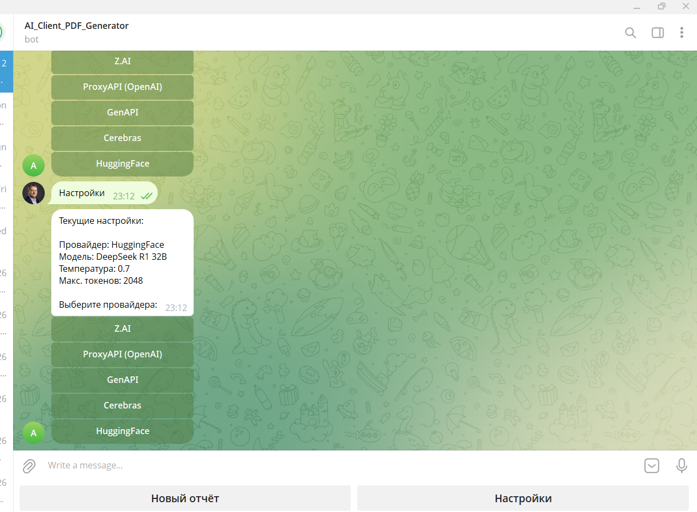

# AI Client PDF Generator

Система автоматической генерации PDF-отчётов по диалогам с клиентами на основе ИИ.

Поддерживает два интерфейса: **CLI** и **Telegram-бот**. Анализирует транскрибацию диалога через LLM, извлекает структурированные данные и формирует профессиональный PDF-отчёт с опциональной AI-генерацией UI-концептов.

---

## Возможности

- Три типа отчётов: базовый, проектный (сроки, бюджет, риски), дизайн (+ AI-изображение)
- 5 LLM-провайдеров: Z.AI, ProxyAPI, GenAPI, Cerebras, HuggingFace — включая бесплатные модели
- 4 бэкенда генерации изображений: Pollinations.ai (бесплатно, без ключа), Together.ai FLUX, DALL-E 3
- Расчёт стоимости каждого запроса в рублях по курсу ЦБ РФ
- Telegram-бот с inline-кнопками, поддержкой файлов и примеров диалогов
- Логирование в терминал и файл, обработка ошибок с retry

---

## Скриншоты

### Telegram-бот

| Старт | Новый отчёт | Выбор примера |
|-------|-------------|---------------|
|  |  |  |

| Выбор модели | Выбор источника | Настройки |
|--------------|-----------------|-----------|
|  |  |  |

### Готовые отчёты

| Базовый отчёт | Проектный отчёт | Дизайн-отчёт |
|---------------|-----------------|--------------|
|  |  |  |

---

## Быстрый старт

### Установка

```bash
git clone https://github.com/MatveiV/AI_Client_PDF_Generator.git
cd AI_Client_PDF_Generator
pip install -r requirements.txt
```

> WeasyPrint на Windows требует GTK. Инструкция: [weasyprint.org](https://doc.courtbouillon.org/weasyprint/stable/first_steps.html#windows)

### Настройка `.env`

```env
BOT_TOKEN=your_telegram_bot_token

ZAI_API_KEY=your_zai_key
PROXY_API_KEY=your_proxyapi_key
GEN_API_KEY=your_genapi_key
CEREBRAS_API_KEY=your_cerebras_key
HF_TOKEN=your_huggingface_token
TOGETHER_API_KEY=your_together_key   # опционально, для FLUX
```

Получить ключи:
- Z.AI: [api.z.ai](https://api.z.ai) — GLM-4.7-Flash и GLM-4.5-Flash **бесплатно**
- Cerebras: [cloud.cerebras.ai](https://cloud.cerebras.ai) — Llama и Qwen **бесплатно**
- HuggingFace: [huggingface.co/settings/tokens](https://huggingface.co/settings/tokens) — **бесплатно**
- Pollinations.ai: ключ **не нужен**

### Запуск CLI

```bash
# Интерактивный режим
python main.py

# С готовым файлом транскрибации
python main.py examples/example_dialog_marketplace.txt
```

### Запуск Telegram-бота

```bash
python bot.py
```

---

## Типы отчётов

### Базовый (`basic`)
Клиент, тема, основной запрос, настроение, следующие шаги.

### Проектный (`project`)
Полный анализ встречи: заказчик и аналитик, основной запрос, ключевые требования, желаемые сроки, оценка разработки, бюджет, технологический стек, риски, удовлетворённость заказчика, следующие шаги.

### Дизайн (`design`)
Требования к UI: стиль, цветовая схема, ключевые экраны, референсы, целевая аудитория. Дополнительно — AI-генерация концепт-изображения интерфейса.

Все отчёты содержат блок затрат: токены, стоимость в USD и RUB по курсу ЦБ РФ.

---

## Структура проекта

```
AI_Client_PDF_Generator/
├── main.py                        # CLI-интерфейс
├── bot.py                         # Telegram-бот
├── config.py                      # Провайдеры и модели
├── .env                           # API-ключи
├── requirements.txt
├── utils/
│   ├── ai_processor.py            # LLM-анализ, 3 системных промпта
│   ├── image_generator.py         # 4 бэкенда генерации изображений
│   ├── pdf_generator.py           # Jinja2 + WeasyPrint
│   ├── cost_calculator.py         # Расчёт стоимости USD/RUB
│   ├── cbr_rate.py                # Курс ЦБ РФ
│   └── settings.py                # Сохранение настроек
├── templates/
│   ├── report_template.html       # Базовый отчёт
│   ├── report_project.html        # Проектный отчёт
│   └── report_design.html         # Дизайн-отчёт
├── examples/
│   ├── example_dialog_marketplace.txt    # Маркетплейс вкладов
│   ├── example_dialog_tokenization.txt   # Токенизация недвижимости
│   └── example_dialog_software.txt       # Система управления задачами
├── reports/                       # Готовые PDF (создаётся автоматически)
├── Screenshots/                   # Скриншоты интерфейса
├── docs/
│   └── architecture.md            # Архитектура: C4, BPMN, UML, Sequence
└── logs/                          # app.log, bot.log
```

---

## LLM-провайдеры

| Провайдер | Бесплатные модели | Ключ |
|-----------|-------------------|------|
| Z.AI | GLM-4.7-Flash, GLM-4.5-Flash | ZAI_API_KEY |
| ProxyAPI | — | PROXY_API_KEY |
| GenAPI | — | GEN_API_KEY |
| Cerebras | Llama 3.1 8B, Qwen 3 235B | CEREBRAS_API_KEY |
| HuggingFace | Llama 3.3 70B, Qwen 2.5 72B, DeepSeek R1 32B | HF_TOKEN |

## Генерация изображений

| Провайдер | Бесплатно | Ключ | Модель |
|-----------|-----------|------|--------|
| Pollinations.ai | Да | Не нужен | FLUX |
| Together.ai | Нет | TOGETHER_API_KEY | FLUX.1 schnell / dev |
| ProxyAPI | Нет | PROXY_API_KEY | DALL-E 3 |

---

## Примеры диалогов

В папке `examples/` три готовых транскрибации для тестирования:

- **Маркетплейс вкладов** — разработка страницы агрегатора вкладов по аналогии с finuslugi.ru
- **Токенизация недвижимости** — платформа для инвестиций в недвижимость через ЦФА
- **Система управления задачами** — корпоративный таск-трекер для строительной компании

---

## Документация

Полная архитектурная документация с диаграммами C4, BPMN, UML и Sequence — в файле [`docs/architecture.md`](docs/architecture.md).

---

## Зависимости

```
openai>=1.30.0
jinja2>=3.1.0
weasyprint>=62.0
python-dotenv>=1.0.0
requests>=2.31.0
python-telegram-bot>=21.0
```
