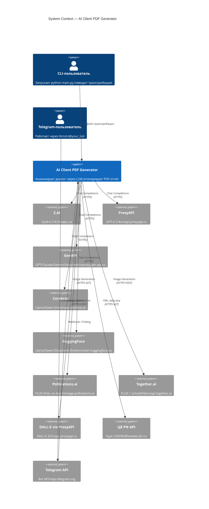
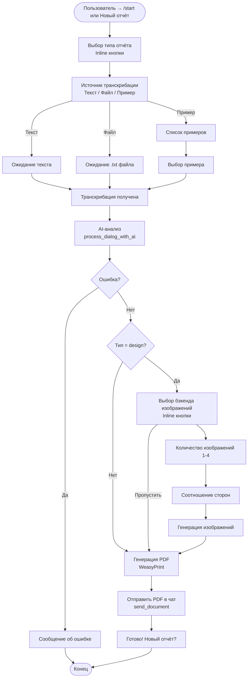
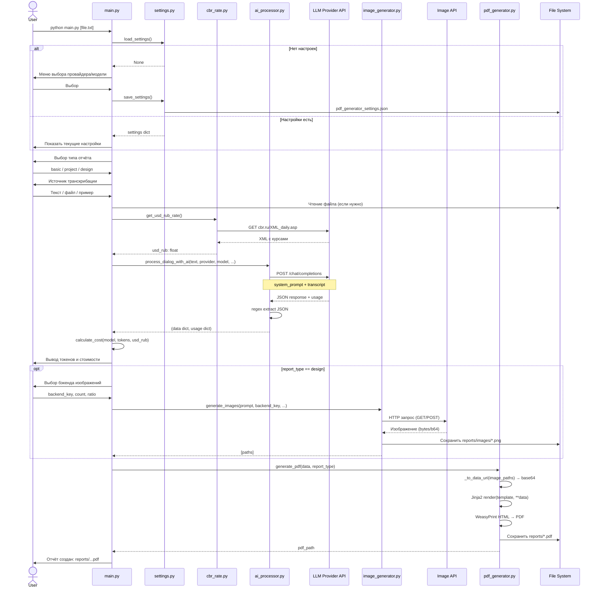
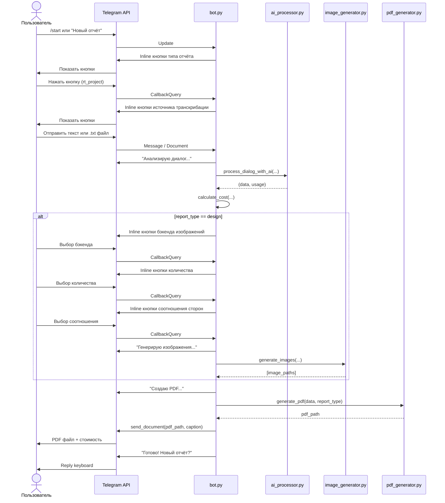
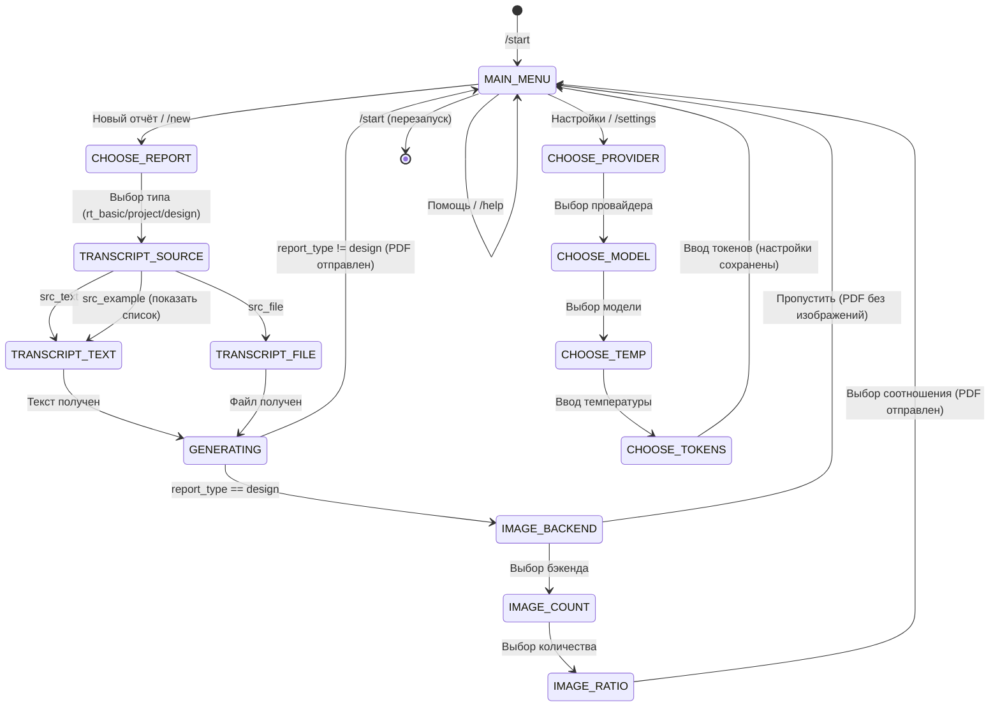
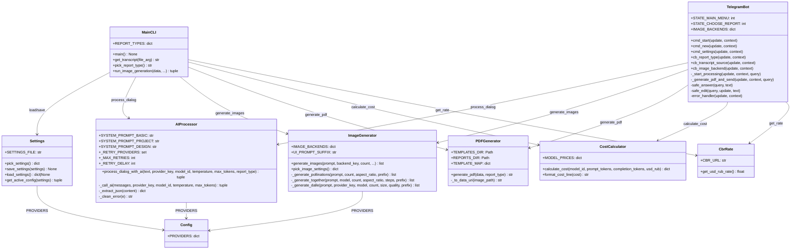
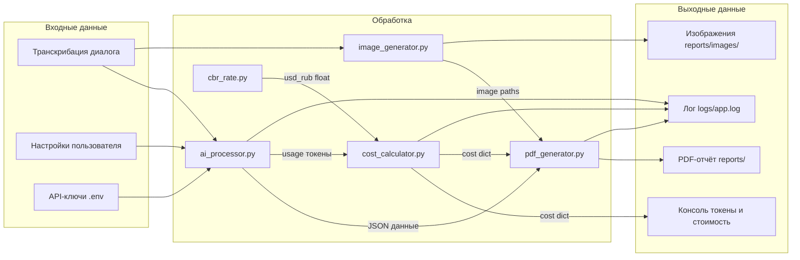

# AI Client PDF Generator — Architecture Documentation

## Project Overview

Dual-interface system (CLI + Telegram bot) that analyzes client dialog transcriptions
using LLM providers and generates professional PDF reports with optional AI-generated UI mockups.

## Quick Start

```bash
# CLI
python main.py
python main.py examples/example_dialog_marketplace.txt

# Telegram Bot
python bot.py
```

## Project Structure

```
.
├── main.py                       # CLI entry point
├── bot.py                        # Telegram bot
├── config.py                     # Providers & models registry
├── .env                          # API keys
├── requirements.txt
├── pdf_generator_settings.json   # Saved user settings (auto-created)
├── utils/
│   ├── ai_processor.py           # LLM analysis, 3 system prompts
│   ├── image_generator.py        # 4 image generation backends
│   ├── pdf_generator.py          # Jinja2 + WeasyPrint pipeline
│   ├── cost_calculator.py        # USD/RUB cost calculation
│   ├── cbr_rate.py               # CBR exchange rate fetching
│   └── settings.py               # Config persistence
├── templates/
│   ├── report_template.html      # Basic report
│   ├── report_project.html       # Project report
│   └── report_design.html        # Design report + images
├── examples/
│   ├── example_dialog_marketplace.txt
│   ├── example_dialog_tokenization.txt
│   └── example_dialog_software.txt
├── reports/                      # Generated PDFs
│   └── images/                   # Generated AI images
├── logs/
│   ├── app.log                   # CLI log
│   └── bot.log                   # Bot log
└── docs/
    └── architecture.md           # This file
```

---

## C4 Model

### Level 1 — System Context



---

### Level 2 — Container Diagram

```mermaid
C4Container
    title Container Diagram — AI Client PDF Generator

    Person(user, "Пользователь")

    Container_Boundary(app, "AI Client PDF Generator") {
        Container(main, "main.py", "Python CLI", "Оркестрирует весь процесс.\nПоддерживает аргумент файла.")
        Container(bot, "bot.py", "Python / python-telegram-bot", "Telegram-бот.\n13 состояний ConversationHandler.")
        Container(config, "config.py", "Python Module", "Реестр провайдеров и моделей.\n5 провайдеров, 20+ моделей.")
        Container(settings, "utils/settings.py", "Python Module", "Сохранение/загрузка настроек.\npdf_generator_settings.json")
        Container(ai_proc, "utils/ai_processor.py", "Python Module", "Запрос к LLM.\n3 системных промпта.\nRetry для нестабильных провайдеров.")
        Container(img_gen, "utils/image_generator.py", "Python Module", "4 бэкенда генерации изображений.\nPollinations / Together / DALL-E.")
        Container(pdf_gen, "utils/pdf_generator.py", "Python Module", "Jinja2 рендер + WeasyPrint.\nBase64 встраивание изображений.")
        Container(cost, "utils/cost_calculator.py", "Python Module", "Расчёт стоимости в USD и RUB.")
        Container(cbr_mod, "utils/cbr_rate.py", "Python Module", "Курс USD/RUB от ЦБ РФ.\nFallback: 90.0")
        ContainerDb(settings_file, "pdf_generator_settings.json", "JSON", "Настройки пользователя")
        ContainerDb(reports_dir, "reports/", "File System", "PDF-отчёты и изображения")
        ContainerDb(logs_dir, "logs/", "Log Files", "app.log, bot.log")
        Container(tmpl, "templates/", "Jinja2 HTML", "3 шаблона отчётов")
    }

    System_Ext(llm_api, "LLM Provider APIs", "Z.AI / ProxyAPI / GenAPI / Cerebras / HuggingFace")
    System_Ext(img_api, "Image APIs", "Pollinations / Together.ai / DALL-E")
    System_Ext(cbr_api, "ЦБ РФ API")
    System_Ext(tg_api, "Telegram API")

    Rel(user, main, "CLI / файл")
    Rel(user, tg_api, "Telegram")
    Rel(tg_api, bot, "Polling")
    Rel(main, settings, "load/save")
    Rel(main, ai_proc, "process_dialog_with_ai()")
    Rel(main, img_gen, "generate_images()")
    Rel(main, pdf_gen, "generate_pdf()")
    Rel(main, cost, "calculate_cost()")
    Rel(main, cbr_mod, "get_usd_rub_rate()")
    Rel(bot, ai_proc, "process_dialog_with_ai()")
    Rel(bot, img_gen, "generate_images()")
    Rel(bot, pdf_gen, "generate_pdf()")
    Rel(bot, cost, "calculate_cost()")
    Rel(bot, cbr_mod, "get_usd_rub_rate()")
    Rel(ai_proc, config, "PROVIDERS dict")
    Rel(img_gen, config, "PROVIDERS dict")
    Rel(settings, settings_file, "R/W JSON")
    Rel(ai_proc, llm_api, "Chat Completions", "HTTPS")
    Rel(img_gen, img_api, "Image Generation", "HTTPS")
    Rel(cbr_mod, cbr_api, "XML_daily.asp", "HTTPS")
    Rel(pdf_gen, tmpl, "Jinja2 render()")
    Rel(pdf_gen, reports_dir, "Сохранить PDF")
    Rel(main, logs_dir, "logging")
    Rel(bot, logs_dir, "logging")
```



---

## LLM Providers & Models

| # | Провайдер | Ключ | Базовый URL | Модели |
|---|-----------|------|-------------|--------|
| 1 | Z.AI | ZAI_API_KEY | api.z.ai/api/paas/v4/ | GLM-4.7-Flash (free), GLM-4.5-Flash (free), GLM-4.7, GLM-4.5, GLM-5 |
| 2 | ProxyAPI | PROXY_API_KEY | api.proxyapi.ru/openai/v1 | GPT-4.1-Nano, GPT-4.1-Mini, GPT-4.1, GPT-4o-Mini, GPT-4o |
| 3 | GenAPI | GEN_API_KEY | proxy.gen-api.ru/v1 | GPT-4.1-Mini, GPT-4.1, GPT-4o, Claude Sonnet 4.5, Gemini 2.5 Flash, DeepSeek Chat, DeepSeek R1 |
| 4 | Cerebras | CEREBRAS_API_KEY | api.cerebras.ai/v1 | Llama 3.1 8B (free), Qwen 3 235B MoE (free) |
| 5 | HuggingFace | HF_TOKEN | router.huggingface.co/v1 | Llama 3.3 70B (free), Qwen 2.5 72B (free), DeepSeek R1 32B (free) |

HuggingFace использует retry: 3 попытки с паузой 8 секунд (нестабильный inference).

---

## Image Generation Backends

| # | Провайдер | Бесплатно | Ключ | Модель | Особенности |
|---|-----------|-----------|------|--------|-------------|
| 1 | Pollinations.ai | Да | Не нужен | FLUX | GET-запрос, без регистрации |
| 2 | Together.ai | Нет | TOGETHER_API_KEY | FLUX.1 [schnell] | $0.003/img, 1-4 шага |
| 3 | Together.ai | Нет | TOGETHER_API_KEY | FLUX.1 [dev] | $0.025/img, 10-50 шагов |
| 4 | ProxyAPI | Нет | PROXY_API_KEY | DALL-E 3 | standard/hd, 1024-1792px |

Все бэкенды добавляют UI-суффикс к промпту для лучшего качества мокапов.
Изображения сохраняются в `reports/images/` и встраиваются в PDF как base64 data URI.

---

## Report Types

### 1. Basic Report (`basic`)

Шаблон: `report_template.html`

Поля JSON от LLM:
```json
{
  "client_name": "...",
  "topic": "...",
  "main_request": "...",
  "mood": "позитивное|нейтральное|негативное|смешанное",
  "next_steps": "..."
}
```

### 2. Project Report (`project`)

Шаблон: `report_project.html`

Поля JSON от LLM:
```json
{
  "project_name": "...",
  "client_company": "...",
  "client_representative": "...",
  "client_position": "...",
  "analyst_name": "...",
  "topic": "...",
  "main_request": "...",
  "key_requirements": ["..."],
  "desired_deadline": "...",
  "estimated_duration": "...",
  "budget": "...",
  "tech_stack": "...",
  "risks": ["..."],
  "client_satisfaction": "позитивная|нейтральная|негативная|смешанная",
  "mood": "...",
  "next_steps": "..."
}
```

### 3. Design Report (`design`)

Шаблон: `report_design.html`

Поля JSON от LLM:
```json
{
  "project_name": "...",
  "client_company": "...",
  "client_representative": "...",
  "client_position": "...",
  "topic": "...",
  "design_style": "...",
  "color_scheme": "...",
  "key_screens": ["..."],
  "references": ["..."],
  "target_audience": "...",
  "platform": "веб|мобильное|десктоп",
  "mood": "...",
  "image_prompt": "English prompt for image generation, max 400 chars",
  "next_steps": "..."
}
```

Дополнительно: генерация изображений через выбранный бэкенд, каждое изображение на отдельной странице PDF.

Все три шаблона содержат блок затрат (`cost`):
- Входные/выходные токены
- Стоимость в USD и RUB
- Курс ЦБ РФ на момент генерации

---

## BPMN — Бизнес-процесс (CLI)

```mermaid
flowchart TD
    Start([Запуск main.py]) --> LoadSettings{Настройки\nсохранены?}

    LoadSettings -- Нет --> PickProvider[Выбор провайдера]
    PickProvider --> PickModel[Выбор модели]
    PickModel --> PickParams[Температура и токены]
    PickParams --> SaveSettings[(Сохранить JSON)]

    LoadSettings -- Да --> ShowSettings[Показать настройки]
    ShowSettings --> Change{Изменить?}
    Change -- Да --> PickProvider
    Change -- Нет --> PickReportType

    SaveSettings --> PickReportType

    PickReportType[Выбор типа отчёта\nbasic / project / design]
    PickReportType --> InputSource{Источник\nтранскрибации}

    InputSource -- Вручную --> ManualInput[Ввод текста]
    InputSource -- Файл --> FileInput[Чтение .txt]
    InputSource -- Пример --> ExampleInput[Выбор из examples/]

    ManualInput --> Validate{Текст\nне пустой?}
    FileInput --> Validate
    ExampleInput --> Validate

    Validate -- Нет --> ErrEmpty[Ошибка: пусто]
    ErrEmpty --> End

    Validate -- Да --> GetRate[Курс USD/RUB от ЦБ РФ]
    GetRate --> RateFail{Ошибка?}
    RateFail -- Да --> UseDefault[Fallback: 90.0]
    RateFail -- Нет --> SendAI
    UseDefault --> SendAI

    SendAI[Отправить в LLM\nprocess_dialog_with_ai]
    SendAI --> AIFail{Ошибка?}
    AIFail -- Да --> ErrAI[Ошибка AI]
    ErrAI --> End

    AIFail -- Нет --> ParseJSON[Парсинг JSON]
    ParseJSON --> CalcCost[Расчёт стоимости]
    CalcCost --> PrintCost[Вывод токенов и стоимости]

    PrintCost --> IsDesign{Тип = design?}
    IsDesign -- Нет --> GenPDF
    IsDesign -- Да --> PickImageBackend[Выбор бэкенда изображений]
    PickImageBackend --> GenImages[Генерация изображений]
    GenImages --> ImgFail{Ошибка?}
    ImgFail -- Да --> WarnNoImg[Предупреждение,\nPDF без изображений]
    ImgFail -- Нет --> GenPDF
    WarnNoImg --> GenPDF

    GenPDF[Jinja2 рендер + WeasyPrint]
    GenPDF --> SavePDF[(Сохранить PDF\nreports/)]
    SavePDF --> PrintResult[Отчёт создан: путь к файлу]
    PrintResult --> Again{Ещё один?}
    Again -- Да --> PickReportType
    Again -- Нет --> End([Завершение])
```



---

## BPMN — Бизнес-процесс (Telegram Bot)



---

## UML — Sequence Diagram (полный цикл CLI)



---

## UML — Sequence Diagram (Telegram Bot)



---

## UML — State Diagram (Telegram Bot)



---

## UML — Class Diagram



---

## Cost Calculation

Формула расчёта стоимости запроса:

```
cost_input_usd  = (prompt_tokens     / 1_000_000) × input_price_per_1M
cost_output_usd = (completion_tokens / 1_000_000) × output_price_per_1M
cost_total_usd  = cost_input_usd + cost_output_usd
cost_total_rub  = cost_total_usd × usd_rub_rate
```

Цены (USD за 1M токенов):

| Модель | Вход | Выход |
|--------|------|-------|
| GLM-4.7-Flash | 0.00 | 0.00 |
| GLM-4.5-Flash | 0.00 | 0.00 |
| GLM-4.7 / GLM-4.5 | 0.14 | 0.14 |
| GLM-5 | 1.00 | 1.00 |
| GPT-4.1-Nano | 0.10 | 0.40 |
| GPT-4.1-Mini | 0.40 | 1.60 |
| GPT-4.1 | 2.00 | 8.00 |
| GPT-4o-Mini | 0.15 | 0.60 |
| GPT-4o | 2.50 | 10.00 |
| Claude Sonnet 4.5 | 3.00 | 15.00 |
| Gemini 2.5 Flash | 0.15 | 0.60 |
| DeepSeek Chat | 0.27 | 1.10 |
| DeepSeek R1 | 0.55 | 2.19 |

Курс USD/RUB получается от ЦБ РФ (`cbr.ru/scripts/XML_daily.asp`). При недоступности используется fallback 90.0 ₽.

---

## Data Flow Diagram



---

## Error Handling

| Ошибка | Место | Поведение |
|--------|-------|-----------|
| LLM API timeout/5xx | ai_processor.py | Retry 3x с паузой 8с (HuggingFace) |
| HTML в теле ошибки | ai_processor._clean_error | Парсинг `<h1>` и `<p>` тегов |
| ЦБ РФ недоступен | cbr_rate.py | Fallback 90.0 ₽ |
| Изображение не найдено | pdf_generator._to_data_uri | Пустая строка, изображение пропускается |
| Telegram TimedOut | bot.error_handler | Логируется как warning, игнорируется |
| Telegram BadRequest "not modified" | bot.error_handler | Тихо игнорируется |
| query.answer() timeout | bot.safe_answer | try/except, игнорируется |
| query.edit_message_text BadRequest | bot.safe_edit | Fallback на reply_text |
| KeyboardInterrupt | main.py | Чистый выход с сообщением |
| Устаревший model_key в настройках | settings.get_active_config | Fallback на первую модель провайдера |

---

## Dependencies

```
openai>=1.30.0          # LLM API client (OpenAI-compatible)
jinja2>=3.1.0           # HTML template rendering
weasyprint>=62.0        # HTML to PDF conversion
python-dotenv>=1.0.0    # .env file loading
requests>=2.31.0        # HTTP for CBR, Pollinations, Together.ai
python-telegram-bot>=21.0  # Telegram Bot API
```

## Environment Variables

```bash
BOT_TOKEN=          # Telegram Bot Token (от @BotFather)
ZAI_API_KEY=        # Z.AI API key
PROXY_API_KEY=      # ProxyAPI key
GEN_API_KEY=        # GenAPI key
CEREBRAS_API_KEY=   # Cerebras API key
HF_TOKEN=           # HuggingFace token
TOGETHER_API_KEY=   # Together.ai API key (для платных FLUX моделей)
```
